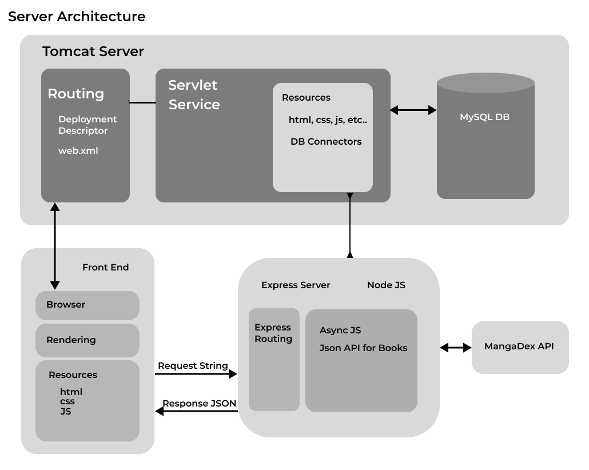
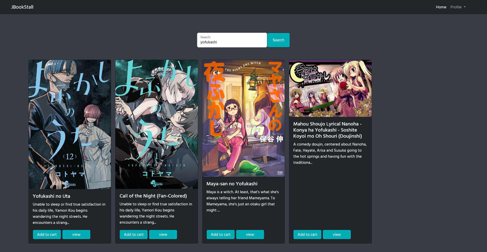
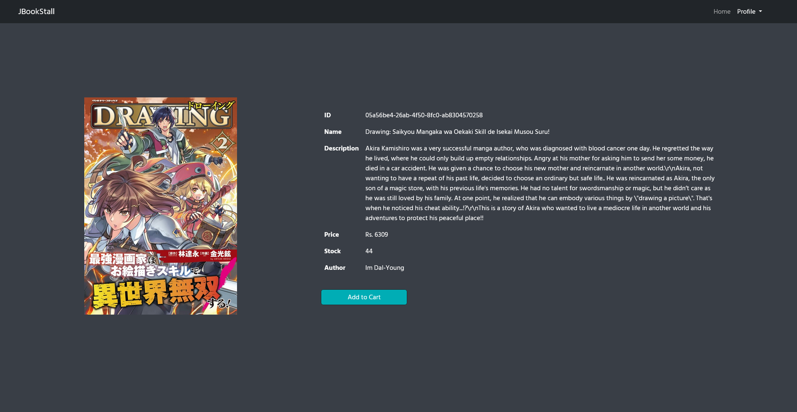
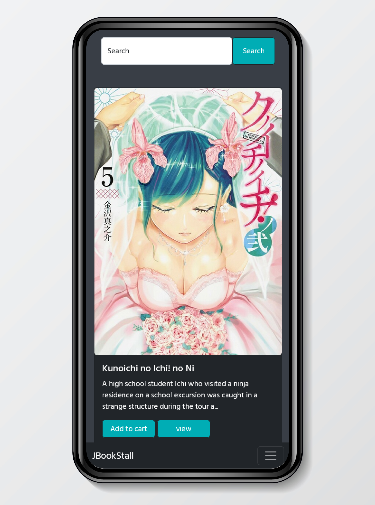
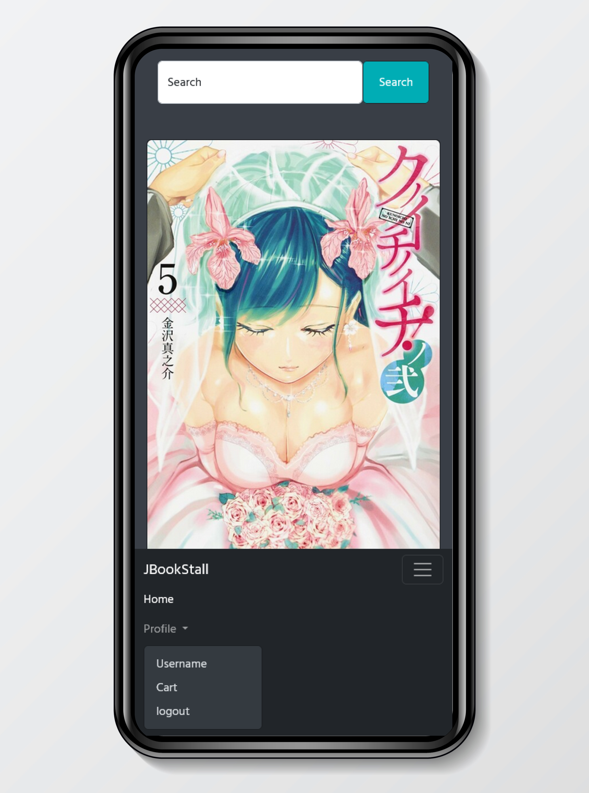

#  jBookStall

A simple book stall managing server, made with java servlet and jsp run using Tomcat.

___
## Tools Used
* ### Dependancies
  * Mangadex api  (for book information and covers)
  * Bootstrap 5
* ### Servers
  * Tomcat
  * Express 

* ### Dev Tools
  * Eclipse
  * Visual Studio Code
  * nodemon
  * live-server
___
## Server Layout

___
## Gallery

mobile backgrond Designed by rawpixel.com / Freepik
